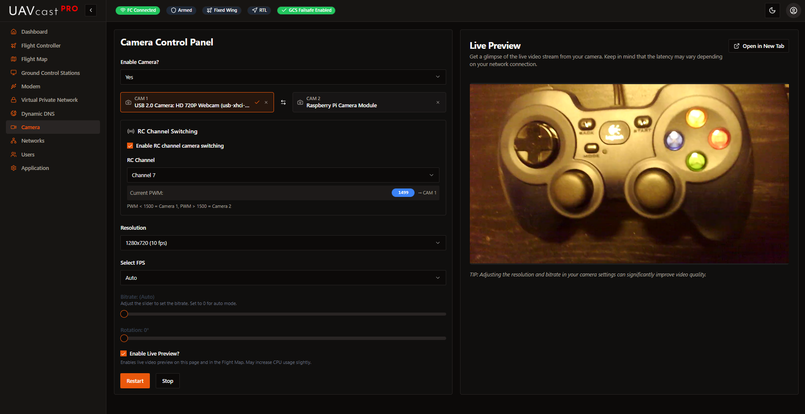
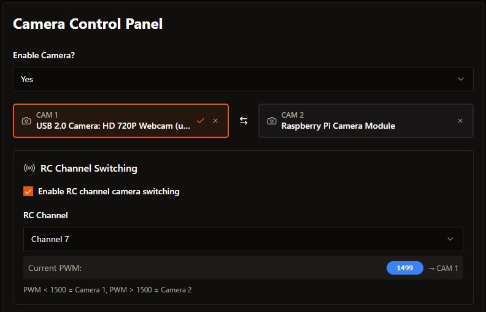
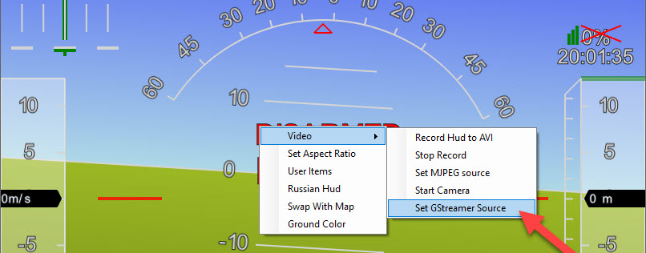

# Camera



UAVcast-Pro streams video from Raspberry Pi cameras or USB cameras to your ground control station using GStreamer with H.264 encoding over UDP.

## Supported Cameras

### Raspberry Pi Camera
- Pi Camera Module v1/v2/v3
- HQ Camera

### USB Cameras
- Logitech C615, C920
- Most V4L2-compatible cameras

Verify connected cameras: `v4l2-ctl --list-devices`

## Video Settings

Resolution, frame rate, and bitrate options are automatically detected from your camera's capabilities.

:::tip Low Bandwidth
For limited connectivity (4G), use lower resolution, 15 FPS, and 1000-1500 Kbps bitrate.
:::

### Pi Camera Options

- **Rotation:** 0°, 90°, 180°, 270°
- **Flip:** Horizontal or vertical mirroring

## Multi-Camera

UAVcast-Pro supports two cameras with instant switching.



### RC Channel Switching

Control camera selection from your transmitter:

1. Enable RC Channel Switching
2. Select RC channel (1-18)
3. PWM threshold: **< 1500 = Camera 1**, **> 1500 = Camera 2**

## Live Preview

The web interface includes an HLS preview powered by MediaMTX.

:::info Preview vs GCS Latency
- **Web preview (HLS):** ~2-3 seconds latency - for setup/monitoring
- **GCS stream (UDP):** ~100-200ms latency - for flight operations
:::

## Custom Pipeline

For unsupported cameras or advanced configurations:

```bash
videotestsrc ! x264enc ! video/x-h264, stream-format=byte-stream ! rtph264pay ! udpsink host=192.168.1.100 port=5600
```

See [GStreamer documentation](https://gstreamer.freedesktop.org/documentation/) for pipeline syntax.

---

## Receiving Video

### Mission Planner / QGroundControl

Both applications receive UDP video on port 5600 automatically.

1. Configure GCS destination in [Ground Control Stations](/docs/6.x/configuration-ground-controller)
2. Enable video for that destination
3. Start camera in UAVcast-Pro
4. Video appears in HUD

#### Custom GStreamer Source (Mission Planner)

Right-click HUD → Video → Set GStreamer Source



```
udpsrc port=5600 caps="application/x-rtp, media=video, clock-rate=90000, encoding-name=H264, payload=96" ! rtpjitterbuffer ! rtph264depay ! avdec_h264 ! videoconvert ! video/x-raw,format=BGRA ! appsink name=outsink
```

---

### GStreamer (Windows)

#### Installation

1. Download from [gstreamer.freedesktop.org/download](https://gstreamer.freedesktop.org/download/)
   - Choose **MSVC 64-bit** runtime installer

:::caution Select Complete Installation
You **must** select **"Complete"** installation. Video will not work with Typical or Custom installation.
:::

2. Open Command Prompt and navigate to GStreamer:
   ```cmd
   cd C:\gstreamer\1.0\msvc_x86_64\bin
   ```

3. Run receive command:
   ```bash
   gst-launch-1.0 -v udpsrc port=5600 caps="application/x-rtp, media=(string)video, clock-rate=(int)90000, encoding-name=(string)H264" ! rtpjitterbuffer ! rtph264depay ! avdec_h264 ! videoconvert ! autovideosink sync=false
   ```

#### Windows Helper Script

Save as `start-video.cmd`:
```cmd
@echo off
cd /d C:\gstreamer\1.0\msvc_x86_64\bin
gst-launch-1.0 -v udpsrc port=5600 caps="application/x-rtp, media=(string)video, clock-rate=(int)90000, encoding-name=(string)H264" ! rtpjitterbuffer ! rtph264depay ! avdec_h264 ! videoconvert ! autovideosink sync=false
pause
```

---

### GStreamer (Ubuntu)

```bash
sudo apt-get update
sudo apt-get install gstreamer1.0-tools gstreamer1.0-plugins-good gstreamer1.0-plugins-bad
```

Then run the same `gst-launch-1.0` command.

---

### GStreamer (Mac)

```bash
brew install gstreamer gst-libav gst-plugins-ugly gst-plugins-base gst-plugins-bad gst-plugins-good
```

Then run the same `gst-launch-1.0` command.

---

### Android

Install [QGroundControl](https://play.google.com/store/apps/details?id=org.mavlink.qgroundcontrol) - video is received automatically on port 5600.

---

## Troubleshooting

### Camera Not Detected

**Pi Camera:**
```bash
libcamera-hello --list-cameras
sudo raspi-config  # Enable camera interface
sudo reboot
```

**USB Camera:**
```bash
v4l2-ctl --list-devices
```

### No Video on GCS

1. Verify GCS destination IP and port in [Ground Control Stations](/docs/6.x/configuration-ground-controller)
2. Check firewall allows UDP 5600
3. Test with `gst-launch-1.0` command

### Choppy Video

Reduce settings: 640x480, 15 FPS, 1500 Kbps

---

## Related

- [Ground Control Stations](/docs/6.x/configuration-ground-controller)
- [Dashboard](/docs/6.x/configuration-dashboard)
- [Networks](/docs/6.x/configuration-networks)
