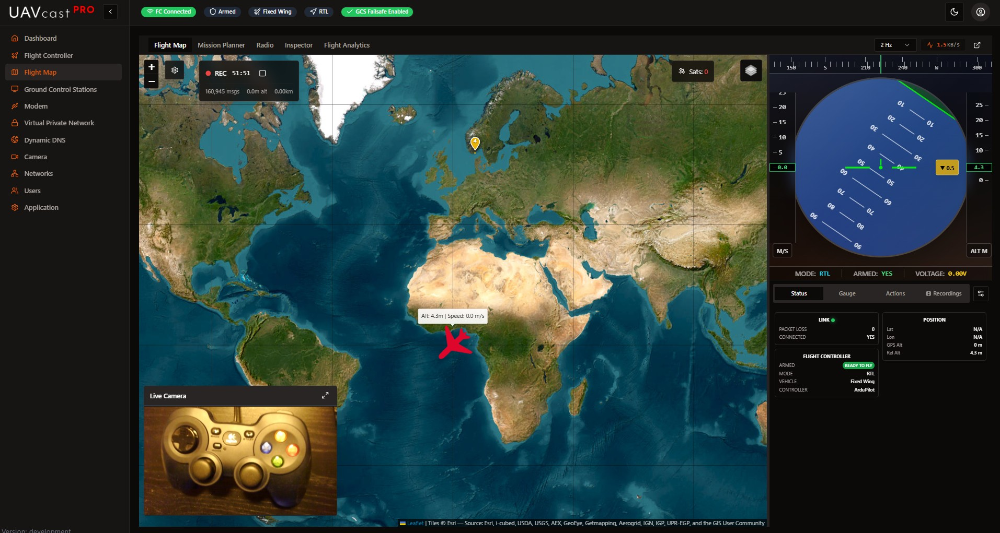
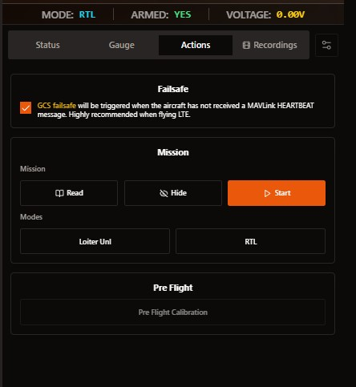
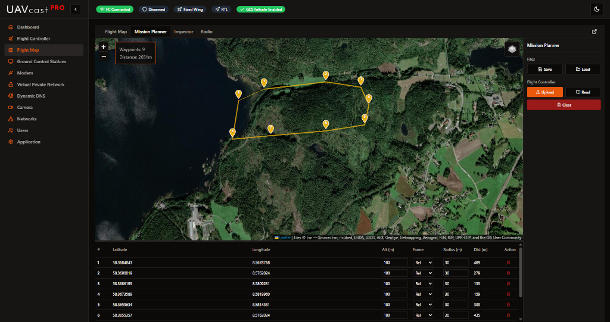
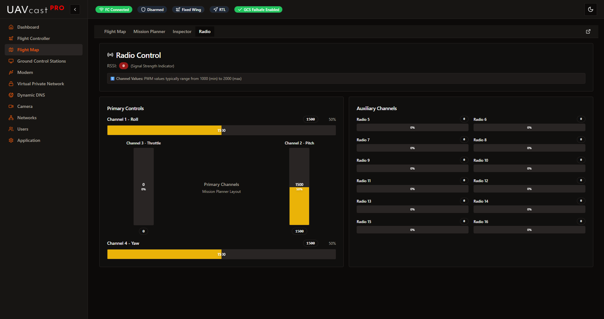
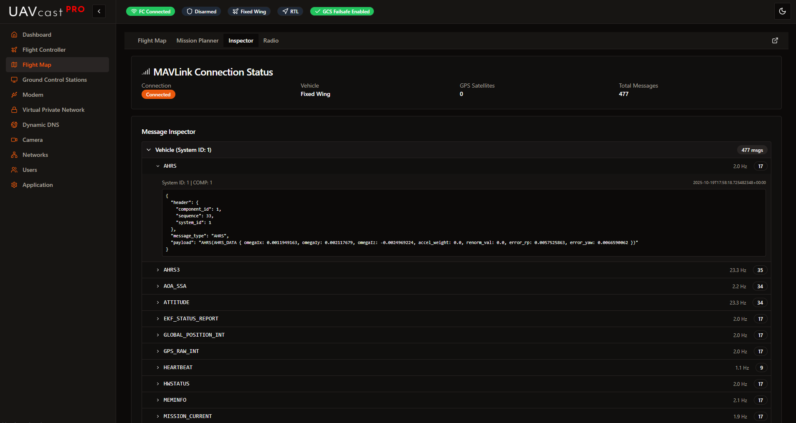
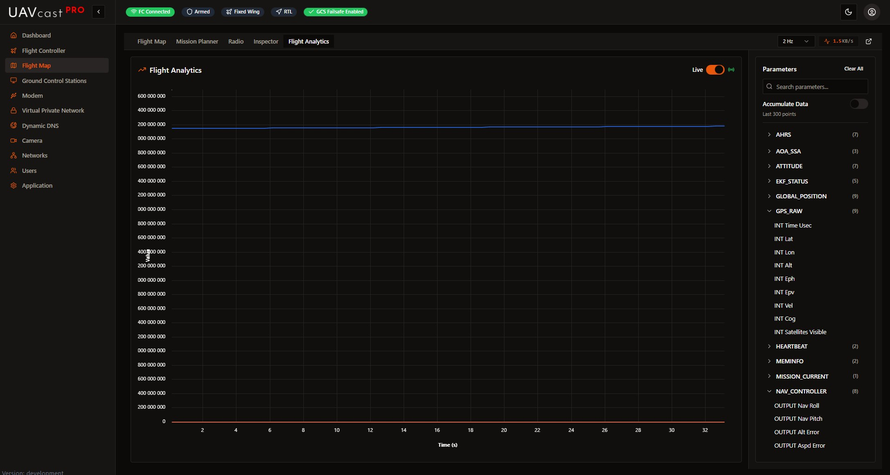

# Flight Map

The Flight Map is your central command interface for real-time flight monitoring and control. It provides live telemetry visualization, flight commands, mission planning, and comprehensive data analysis tools.

## Overview

The Flight Map page features a tabbed interface with five main sections:

| Tab | Description |
|-----|-------------|
| **Flight Map** | Interactive map with real-time vehicle tracking |
| **Mission Planner** | Create and upload autonomous flight missions |
| **Radio** | RC channel input visualization |
| **Inspector** | MAVLink message debugging and analysis |
| **Flight Analytics** | Telemetry data graphing and log analysis |

## Flight Map Tab

### Interactive Map

The map displays your vehicle's real-time position with:

- **Vehicle Marker**: Rotating icon showing heading (quadcopter or plane based on vehicle type)
- **Flight Path Trail**: Configurable history trail showing recent flight path
- **Home Marker**: Launch position with distance indicator
- **Mission Waypoints**: Numbered markers with route lines when mission is loaded

**Map Controls:**
- **Layer Toggle**: Switch between Street Map (OpenStreetMap) and Satellite (Esri) views
- **Auto-Pan**: Automatically keeps vehicle centered in view
- **GPS Satellites**: Shows current satellite count
- **Right-Click Menu**: Quick access to Return to Launch command

### Map Settings

Click the settings icon to configure:

- **Auto-Pan**: Enable/disable automatic camera following
- **Show Aircraft Heading**: Display heading rotation on marker
- **Flight Path Trail**:
  - Toggle trail visibility
  - Adjust trail length (50-1000 points)
  - Custom trail color
  - Clear trail button
- **Home Marker**: Toggle visibility and distance display

### Live Camera Overlay

When camera preview is enabled, a draggable video window appears on the map:

- **Drag**: Move window anywhere on the map
- **Resize**: Drag edges or corners to resize
- **Minimize/Maximize**: Toggle compact mode
- Position and size are saved automatically

## Sidebar Views

The right sidebar provides three viewing modes:

### Data View

Displays telemetry in customizable status cards:

| Card | Information |
|------|-------------|
| **Link** | Connection status, packet loss |
| **Flight Controller** | Armed state, flight mode, vehicle type |
| **GPS** | Fix type, satellites, altitude (relative/MSL), coordinates |
| **Battery** | Voltage, current, remaining percentage |
| **Speed** | Ground speed, air speed, throttle, heading |
| **Attitude** | Pitch, roll, yaw, climb rate |
| **Home** | Home coordinates, distance from home |
| **Telemetry** | Data rate (KB/s), messages/sec |

### Gauge View

Classic analog flight instruments in a 2x2 grid:

- **Airspeed Indicator**: Ground speed visualization
- **Altitude Indicator**: Current altitude with trend
- **Compass**: Heading direction indicator
- **Vertical Speed**: Climb/descent rate

### HUD View

Head-Up Display overlay showing:
- Heading tape (top)
- Speed tape (left)
- Altitude tape (right)
- Artificial horizon with pitch ladder (center)

## Actions Tab

Flight control commands accessible from the sidebar:

### Failsafe

- **GCS Failsafe**: Enable heartbeat monitoring. Vehicle triggers failsafe if no MAVLink heartbeat received. **Highly recommended for LTE flights.**

### Mission Control

- **Read**: Download current mission from flight controller
- **Hide**: Remove mission waypoints from map display
- **Start**: Begin autonomous mission execution (requires confirmation)

### Flight Modes

- **Loiter Unlimited**: Vehicle holds position and circles at current location
- **Return to Launch (RTL)**: Vehicle returns to home position

### Pre-Flight

- **Pre-Flight Calibration**: Run pre-arm checks (disabled when armed)

:::warning Safety First
All flight commands require confirmation dialogs. Ensure your aircraft is in a safe location before executing commands.
:::

## Mission Planner Tab

Create autonomous flight missions by placing waypoints on the map.

### Creating a Mission

1. Click on the map to add waypoints
2. Set default altitude and radius when prompted
3. Drag waypoints to adjust position
4. Edit waypoint details in the table

### Waypoint Table

Each waypoint displays:
- **#**: Waypoint number
- **Latitude/Longitude**: GPS coordinates
- **Altitude**: Height in meters
- **Frame**: Relative, Absolute, or Terrain
- **Radius**: Acceptance radius in meters
- **Distance**: Distance from previous waypoint

### Mission Actions

| Button | Action |
|--------|--------|
| **Save** | Save mission to file on device |
| **Load** | Load saved mission file |
| **Upload** | Send mission to flight controller |
| **Read** | Download mission from flight controller |
| **Clear** | Remove all waypoints |

### Altitude Frame Options

- **Relative (Rel)**: Altitude above takeoff point
- **Absolute (Abs)**: Altitude above sea level (MSL)
- **Terrain (Ter)**: Altitude above ground level (requires terrain data)

## Radio Tab

Real-time visualization of RC transmitter inputs.

### Primary Controls

Mission Planner-style layout showing the four main channels:

- **Channel 1 - Roll**: Horizontal bar with center reference
- **Channel 2 - Pitch**: Vertical bar with center reference
- **Channel 3 - Throttle**: Vertical bar (0-100% range)
- **Channel 4 - Yaw**: Horizontal bar with center reference

### Auxiliary Channels

Channels 5-16 displayed in a grid layout, each showing:
- PWM value (typically 1000-2000)
- Percentage bar
- Channel number

### Signal Strength

- **RSSI**: Received Signal Strength Indicator
- PWM values: 1000 (min) to 2000 (max)

## Inspector Tab

Debug and analyze MAVLink communication.

### Connection Status

Displays current connection information:
- Connection state (Connected/Disconnected)
- Vehicle type
- GPS satellite count
- Total messages received

### Message Inspector

Hierarchical tree view showing:
- **Vehicle**: Grouped by System ID
- **Message Types**: All received MAVLink message types
- **Message Data**: Expandable JSON payload
- **Frequency**: Messages per second (Hz)
- **Count**: Total messages of each type

Useful for debugging MAVLink communication issues and verifying data flow.

## Flight Analytics Tab

Graph and analyze telemetry data in real-time or from recorded logs.

### Live Mode

- Real-time graphing of selected parameters
- Up to 6 parameters displayed simultaneously
- Configurable data accumulation (all points or rolling window)

### File Mode

1. Click **Open Log File**
2. Select a recorded .tlog file
3. Parameters populate automatically
4. Select parameters to graph

### Available Parameters

Search and select from all available MAVLink parameters including:
- Altitude, speed, heading
- Battery voltage, current
- GPS coordinates
- Attitude (pitch, roll, yaw)
- And many more...

### Graph Controls

- **Accumulate Data**: Store all points vs. rolling window
- **Clear All**: Reset selected parameters
- **Search**: Filter parameter list

## Flight Recordings

Record MAVLink telemetry for later playback and analysis.

### Recording Controls

- **Auto-record on Armed**: Automatically start recording when vehicle arms
- **Start Recording Now**: Manual recording trigger
- **Stop Recording**: End current recording session

### Recording List

Each recording shows:
- Mission name and timestamp
- Duration (mm:ss)
- Message count
- Maximum altitude
- Total distance traveled

### Recording Actions

- **Play**: Replay recording on the flight map
- **Download**: Export as .tlog file
- **Rename**: Change recording name
- **Delete**: Remove recording

### Playback Mode

When playing a recording:
- Timeline slider appears for seeking
- Telemetry replays on the map
- Vehicle position animates along recorded path

## Detached Map Window

For multi-monitor setups, open the flight map in a separate window:

1. Click the "Open in new window" button
2. A 1920x1080 window opens with the full map interface
3. Ideal for dedicated flight monitoring display

## Troubleshooting

### No Telemetry Data

1. Verify flight controller is connected and configured
2. Check MAVLink connection in Flight Controller settings
3. Ensure correct baud rate and port
4. Look for connection status in Inspector tab

### Map Not Loading

1. Check internet connection (required for map tiles)
2. Try switching between Street and Satellite layers
3. Clear browser cache

### Video Overlay Not Showing

1. Enable Live Preview in Camera settings
2. Start the camera service
3. Verify camera is streaming

### Mission Upload Fails

1. Ensure vehicle is connected
2. Check flight controller is not armed
3. Verify waypoints are valid (within range, proper altitude)

## Related Pages

- [Camera](/docs/6.x/configuration-camera) - Configure video streaming
- [Flight Controller](/docs/6.x/configuration-flight-controller) - MAVLink connection settings
- [Ground Control Stations](/docs/6.x/configuration-ground-controller) - External GCS configuration
